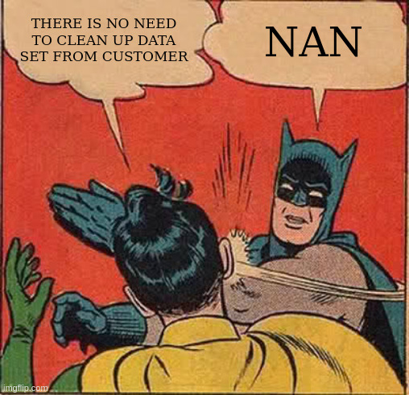

# Journal — 2025-09-20 (Day 2)

## 1) What I learned (bullets, not prose)
- Best practices for setting up dashboards in **Metabase**. Also, what practices to avoid (i.e., create views when you should've created tables).
- What aspects to focus on in building data pipelines. How to remedy problems by finding creative solutions.
- There's so much stuff to learn from people of different backgrounds. It's good practice to brainstorm for business questions and approaches to learn what to focus on during querying.

## 2) New vocabulary (define in your own words)
- **SQL (Structured Query Language)** - Kinda like talking to databases: ask questions, get answers.  
- **ETL (Extract, Transform, Load)** - Grab data, clean it up, then drop it where it belongs.  
- **ELT (Extract, Load, Transform)** - Same idea, but faster: load everything first, then fix it inside the warehouse.  
- **dlt (Data Load Tool)** - A helper that moves data from Point A to Point B.  
- **dbt (Data Build Tool)** - Turns messy data into neat, organized tables through SQL.  
- **OLAP (Online Analytical Processing)** - Databases that love big-picture questions (great for reports and trends).  
- **OLTP (Online Transaction Processing)** - Databases built for speed (i.e., bank transactions or online orders.)  

## 3) Data Engineering mindset applied (what principles did I use?)
- Move data once!
- **Raw → Clean → Mart** (separate layers)  
   Raw data should stay untouched. Cleaned data becomes analysis-ready, and marts are polished for sharing.  
   *Example:* Cleaning up `auto.mpg` wasn’t optional — it was the only way to make the analysis actually work.
  

## 4) Decisions & assumptions (why, alternatives, trade-offs)
- While cleaning `auto_mpg`, I tested different ways of **ordering cars** — by displacement, horsepower, weight, and acceleration.  
  My physics brain was curious: do the “heavier vs. faster vs. more powerful” relationships actually hold up in the dataset?  
  - *Trade-off:* It was fun and insightful, but sorting alone doesn’t prove causation.  
- I also tried **grouping cars by model year** to see if newer cars really outperform older ones (better horsepower or quicker acceleration).  
  - Assumption: newer tech should mean better performance.  
  - *Reality check:* sometimes regulations (like fuel efficiency rules) actually reduced horsepower, so the “newer is better” idea wasn’t always true.
- Overall, I leaned on the principle that **exploration is part of cleaning**. Even if some checks don’t lead to final insights, they help me spot patterns or weird outliers worth investigating later.  

## 5) Open questions (things I still don’t get)
- What’s the best way to store large datasets on a **personal laptop**?  
  I’ve only got so much disk space… and gigabytes disappear fast 😅  

## 6) Next actions (small, doable steps)
- **Explore Git more** - still fumbling with deleting assets… ahahaha, but progress is progress.  
- **Try out PostgreSQL** - DataCamp has lessons on normalization, and I want to see how it works in practice.  
- **Level up querying** - querying is fun, but I’d like to figure out *what’s the smartest thing to query first* (instead of just poking around randomly).  

## 7) Artifacts & links (code, queries, dashboards)
- https://dataengineering.ph/

---

### Mini reflection (3–5 sentences)
What surprised me? What would I do differently next time? What will I watch out for in production?

I was surprised by how smoothly different tools can work together (like VS Code and DBeaver).  
Next time, I’ll organize my files better so I’m not hunting around my laptop like it’s a scavenger game.  
That small habit should save me time in “production” instead of me poking through every random folder.  

### BONUS: What is a meme that best describes what you feel or your learning today?

