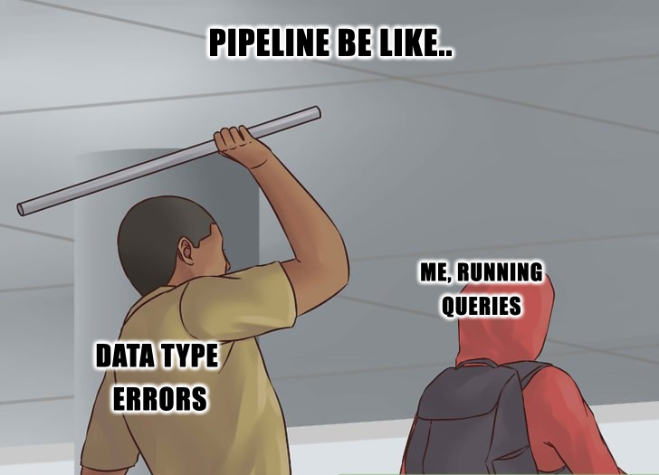

# Journal — 2025-09-25 (Day 3)

## 1) What I learned (bullets, not prose)
- The importance of designing a **clear workflow** early on so errors are caught before production.  
- How **data cleaning** goes beyond fixing nulls — it includes checking data types, row counts, and formatting consistency.  
- Why validating **integers, strings, and row numbers** is a quick but efficient way to confirm data integrity after cleaning.  
- The benefit of maintaining a **shared repository or journal** to track transformations, issues, and decisions made during the cleaning process.  
- How to adapt communication when presenting to **non-technical or non-data engineering audiences** by focusing on outcomes rather than pipelines.  
- That **one shared pipeline** for a team can simplify collaboration, but also introduces risk: if the pipeline breaks or becomes corrupted, the entire project is affected.

## 2) New vocabulary (define in your own words)
- **Data cleaning** – The process of improving raw data quality by removing errors, correcting types, handling nulls, and validating consistency.  
- **Data validation** – A final check to ensure cleaned data still makes sense (correct data type, expected row counts, reasonable values).  
- **Shared repository** – A collaborative space (like GitHub) where team members push changes, track versions, and document their work.  
- **Post-production (post-prod)** – The phase after deployment where unexpected issues are monitored and fixed — ideally minimized by careful pre-prod workflows.  
- **Pipeline contamination** – When a bug, incorrect transformation, or dirty data affects the entire downstream process.

## 3) Data Engineering mindset applied (what principles did I use?)
- **Early detection over late reaction:** solve problems *before* production instead of reacting later — by adding early checks, cleaning steps, and documentation.  
- **Trust but verify:** don’t just assume cleaned data is correct — validate row counts, types, and distribution after each step. 
- **Documentation as a tool:** a shared repo or journal is not just record-keeping, but can be used for bridging communication for asynchronous teamwork.  
- **Simplicity over redundancy:** one shared pipeline is efficient, but only if paired with strong monitoring and rollback plans.

## 4) Decisions & assumptions (why, alternatives, trade-offs)
- We decided to **use one group pipeline** instead of multiple separate ones.  
  - *Trade-off:* Easier collaboration and fewer conflicts, but if the pipeline is faulty, the entire team’s output is compromised.  
- We included **type checks and row validations** after cleaning.  
  - *Assumption:* Catching errors immediately is more efficient than debugging later during analysis.  
- We maintained a **shared cleaning log** in the repository.  
  - *Alternative:* Individual notes, but that would make it harder to trace decisions and troubleshoot.  

## 5) Open questions (things I still don’t get)
- How do large teams coordinate pipeline changes without breaking production workflows?  
- What’s the best practice for **rollback** if the shared pipeline fails mid-process? Instead of just repeating the steps for ingestion and querying.
- When is it worth creating **multiple pipelines** for safety despite extra maintenance?
- Is there a best practice for **automated data validation** beyond type checks and row counts (i.e., thrird party apps?  

## 6) Next actions (small, doable steps)
- Automate data type checks with SQL or Python scripts to reduce manual review.  
- Document the **full cleaning workflow** in the shared repo with commit messages. Also, experiment with Git branching strategies to manage multiple contributors in a shared repo.
- When presenting data from pipelines, draft a **“presentation template”** for non-technical stakeholders, focusing on business impact rather than code.

## 7) Artifacts & links (code, queries, dashboards)
Our shared repo (Group 1): https://github.com/cardibhie/ftw_de_etl_girls/blob/main/clickhouse/2025-09-20-assignment.md

---

### Mini reflection (3–5 sentences)
Today reminded me that data engineering is as much about **team processes** as it is about code. Cleaning the Chinook database showed how important it is to validate data types and row counts, because even small mistakes can snowball later. I also realized the power of a shared repol; it not only keeps everyone aligned but also documents our journey step by step. At the end of the session, I learned how to improve my technical skills and how to communicate better with teammates.  

### Personal Insightful Questions
- How do I know if a pipeline is **“clean enough”** to trust, or am I overchecking and slowing down the workflow?  
- What’s the best balance between **automation vs manual inspection** in cleaning? When do I stop looking at raw rows myself?  
- What’s the best practice for **rollback** if the shared pipeline fails mid-process, instead of just repeating ingestion and queries?  
- When is it worth creating **multiple pipelines** for safety despite the extra maintenance work?  
- How can I make sure my documentation is **helpful for future teammates** and not just a personal diary of steps?  
- In group projects, how do I **communicate data issues** clearly to non-technical teammates without overwhelming them?  

### BONUS: Interactive Meme Moment
What meme fits your SQL journey today?

