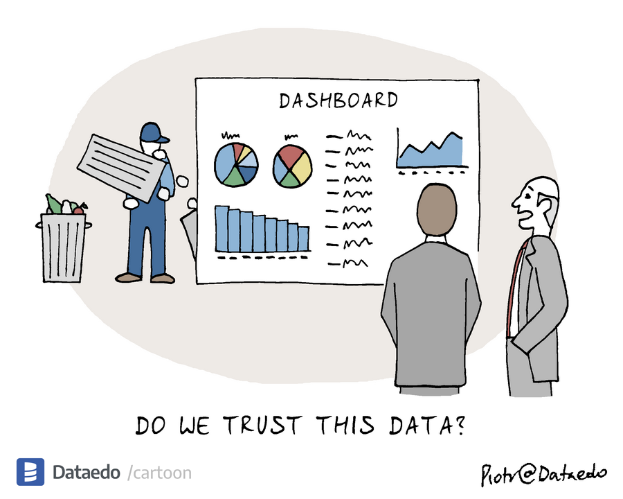
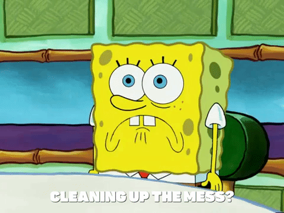

# Journal — 2025-10-04 (Day 4)

## 1) What I learned (bullets, not prose)
- Why **data quality (DQ)** matters — bad inputs scale into bigger, faster mistakes.  
- That “quality” is broader than accuracy: it includes **completeness, reliability, relevancy, and timeliness**.  
- The **cost of bad data**: lost time, wrong business decisions, “dashboard shame,” and model drift.  
- How DQ checks live across the stack: **ingestion (schema, freshness), transform (nulls, categories), mart (reasonableness, uniqueness), reporting (data health cards)**.  
- The concept of a **DQ contract** (thresholds, owners, policies) and how to tag rules as “warn vs fail.”  
- How to log checks over time, not just pass/fail, to see **trends in data quality**.  
- Levels of maturity in monitoring: **SQL checks → config runners → dbt tests → observability platforms**.  
- The role of **shared Git workflows** for collaboration: branching, pull requests, commit history as a form of data journaling.  
- The difference between **analyst presentations** (narrative, temporal) and **automated dashboards** (persistent, interactive, operational).  
- Building a simple **DQ dashboard** (row counts, null checks, category validation, volume trends).  

## 2) New vocabulary (define in your own words)
- **Data Quality (DQ):** A measure of how trustworthy and useful data is, including timeliness, accuracy, and completeness.  
- **DQ Contract:** A documented agreement that defines required checks, acceptable thresholds, and policies for handling bad data.  
- **Warn vs Fail:** A testing policy where some issues only trigger a warning, while others block deployment.  
- **Freshness lag:** The delay between when new data should arrive and when it actually appears in the pipeline.  
- **Maturity model (DQ):** A staged framework describing how advanced your monitoring is — from simple checks to full observability.  
- **Branching strategy:** A Git workflow approach (main, feature branches, pull requests) that prevents conflicts while keeping a clean commit history.  
- **Dashboard shame:** When stakeholders lose trust because dashboards are outdated, wrong, or inconsistent.  

## 3) Data Engineering mindset applied (what principles did I use?)
- **Trust is layered:** Accuracy alone doesn’t guarantee reliability — need completeness, timeliness, and transparency.  
- **Measure twice, deploy once:** Logging and validating data before publishing prevents embarrassing errors downstream.  
- **Version control is part of data quality:** Git isn’t just for code — commit logs and branches help track experiments, fixes, and accountability.  
- **Transparency builds trust:** Documenting what checks exist, their thresholds, and ownership keeps teams aligned.  
- **Audience-first thinking:** Dashboards should tell stakeholders what actions to take, not just dump metrics.  

## 4) Decisions & assumptions (why, alternatives, trade-offs)
- Decided to **log DQ results into a document** for trends.  
  - *Alternative:* Only check in the moment, but no history = blind spots.  
- Decided to **build a minimal DQ dashboard** with nulls, row counts, and category checks.  
  - *Assumption:* Simple visibility is better than none, even if advanced anomaly detection is not in place yet.
    
## 5) Open questions (things I still don’t get)
- How far should we take DQ in small projects — when is Level 1 (SQL checks) “good enough”?  
- What’s the best practice for **quarantining bad partitions** without blocking the whole pipeline?  
- How do large orgs decide **who owns DQ contracts** (analyst, engineer, data steward)?  
- How should branching strategies evolve when pipelines become very large and involve multiple teams?

## 6) Next actions (small, doable steps)
- Add **logging tables** for DQ checks to track trends (not just single-run results).  
- Test different **branching strategies** in Git (feature branch → PR → main) for pipeline work.  
- Draft a **data quality checklist** that includes required fields, ranges, and freshness.  
- Build a **starter DQ dashboard** in Metabase showing row counts, nulls, and category validity.  

## 7) Artifacts & links (code, queries, dashboards)
- GitHub repo with branching workflow experiment: https://github.com/cardibhie/ftw_de_etl_girls/blob/main/assignment-docus/2025-10-04.md?plain=1
- Dashboard for OULAD: http://54.87.106.52:3001/dashboard/42-group-1-dashboard-oulad?tab=46-health-overview

---

### Mini reflection (3–5 sentences)
Today pushed me to see DQ not just as cleaning but as a **continuous monitoring practice**. I realized that Git workflows are themselves a form of data quality control as they give visibility, accountability, and paths to rollback. Building the DQ dashboard was a reminder that even simple checks can restore trust of stakeholders if made visible. The session also made me think harder about balancing technical rigor with practical limits on time and team capacity.  

### Personal Insightful Questions
- How do I decide when a dataset is **“trustworthy enough”** to publish, especially if checks never fully pass?  
- What habits can I adopt to keep DQ checks **transparent but not overwhelming** for teammates?  
- How can branching strategies in Git be adapted to **mirror DQ maturity levels** (from ad-hoc to production-grade)?  
- When presenting DQ dashboards, how do I explain **data risks to non-technical stakeholders** without scaring them off?  
- Is it better to **alert on all DQ issues** or only critical failures to avoid “alarm fatigue”?  

### BONUS: Interactive Meme Moment
What meme sums up your DQ struggles today?  

