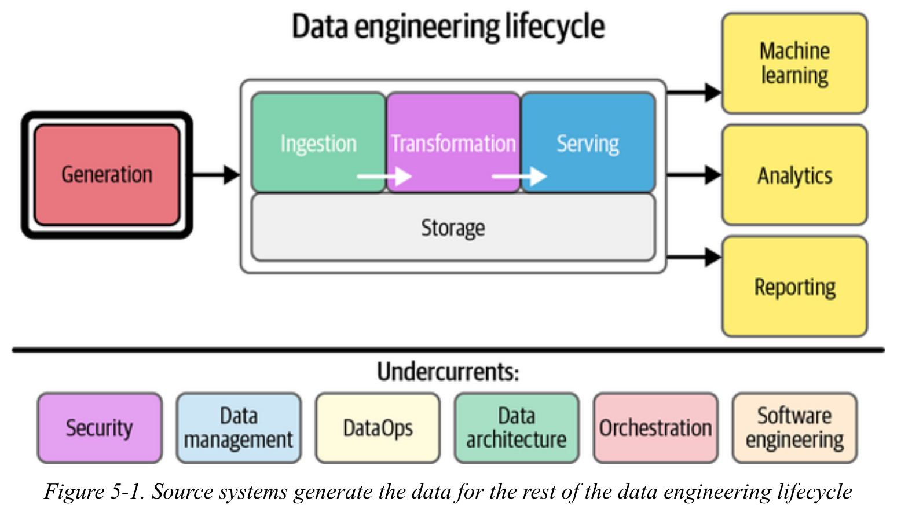

# Journal — 2025-10-11 (Day 5)

Heh, I learned how to do this:
| **Question No.** | **Section Title** |
|------------------|------------------|
| 1️⃣ | [What I learned](#1-what-i-learned) |
| 2️⃣ | [New vocabulary (define in your own words)](#2-new-vocabulary-define-in-your-own-words) |
| 3️⃣ | [Data Engineering mindset applied (what principles did I use?)](#3-data-engineering-mindset-applied-what-principles-did-i-use) |
| 4️⃣ | [Decisions & assumptions (why, alternatives, trade-offs)](#4-decisions--assumptions-why-alternatives-trade-offs) |
| 5️⃣ | [Open questions (things-i-still-dont-get)](#5-open-questions-things-i-still-dont-get) |
| 6️⃣ | [Next actions (small, doable steps)](#6-next-actions-small-doable-steps) |
| 7️⃣ | [Artifacts & links (code, queries, dashboards)](#7-artifacts--links-code-queries-dashboards) |

---

## 1) What I learned (bullets, not prose)
- The **data lifecycle** connects the real world to digital representation — from *collection → storage → transformation → serving → visualization*.  
- Data comes in different **shapes** — *tabular (CSV/SQL), hierarchical (JSON/XML), graph (RDF/Neo4j), time series (Parquet/Influx),* and *geospatial (GeoJSON/Shapefile)* — each with trade-offs in storage and analysis.  
- Understood how **data formats** affect performance: *CSV* is human-readable but heavy; *JSON* is flexible; *Parquet* and *ORC* are optimized for analytics with columnar compression.  
- Learned the structure of **APIs** — endpoints, methods, parameters, and responses — and how to read documentation effectively for data extraction.  
- Gained clarity on **web scraping levels**: static HTML (easiest), dynamic (JS-rendered, requires inspection), and protected (off-limits without permission).  
- Realized **data ethics** is a foundation of all technical work. Consent, privacy, and transparency matter as much as pipeline performance.  
- Practical introduction to **pandas** and **ibis** as bridges for working with files, SQL databases, and APIs in Python.  
- Helpful career insights: *continuous learning*, *portfolio visibility*, and *clear storytelling* matter more than technical jargon when presenting DE work.  

## 2) New vocabulary (define in your own words)

- **Data Lifecycle:** The complete journey of data from collection to visualization, ensuring value creation at each step.  
- **Tabular vs Hierarchical Data:** Flat tables (rows and columns) versus nested key-value or tree structures like JSON and XML. 
- **Columnar Storage:** File organization (like Parquet or ORC) that stores columns together for faster analytical queries.  
- **API (Application Programming Interface):** A bridge that allows one system to request and receive data from another using structured requests.  
- **Endpoint:** The specific URL that returns a particular dataset or service from an API.  
- **Rate Limit:** A restriction on how frequently an API can be queried to prevent overload or misuse.  
- **Static vs Dynamic Pages:** Static pages contain visible data in HTML; dynamic pages rely on JavaScript to load data after the page renders.  
- **Data Ethics:** The moral responsibility of collecting, storing, and sharing data with respect for consent, privacy, and fairness.  

## 3) Data Engineering mindset applied (what principles did I use?)
- **Data has context and shape:** Knowing how and why data is stored a certain way helps you clean and model it better.  
- **Ethics over convenience:** Just because data is accessible doesn’t mean it’s right to collect it. Always check source permissions.  
- **Version your understanding:** Learning in DE is iterative. Each concept builds on previous commits, and revisiting them deepens understanding.  
- **Automation with caution:** APIs and scrapers should be handled responsibly — automation must respect rate limits and terms of service.   

## 4) Decisions & assumptions (why, alternatives, trade-offs)
- Chose to **practice web scraping with static pages first** before handling JavaScript-rendered ones.  
  - *Alternative:* Jump directly to dynamic pages using Selenium, but that adds unnecessary complexity early on.  
- Decided to **focus on understanding different data formats** (CSV, JSON, Parquet) before automating extraction.  
  - *Reason:* Knowing how each format behaves makes it easier to choose the right one later when scaling pipelines.  
- Prioritized **ethical considerations when collecting web data**, ensuring that scraping stayed within allowed and transparent boundaries.  
  - *Alternative:* Collect more freely, but that risks violating site terms and user privacy.
    

## 5) Open questions (things I still don’t get)
- How can I tell if the data I’m collecting is both useful and ethically safe to use?  
- When should I rely on an API instead of scraping, and what clues suggest one is available behind a site?  
- How can I stay curious about data while still being careful with what I collect or share?  
- How can teams make it easier to track schema or data changes automatically without breaking pipelines?  
- As I improve my technical skills, how can I make sure I’m still using data in fair and responsible ways?  

## 6) Next actions (small, doable steps)
- Build a small **web scraping notebook** using `requests` + `BeautifulSoup` for static HTML data.  
- Try reading a public **JSON API** using `pandas.read_json()` and inspect its schema. 
- Experiment with **converting CSV to Parquet** to see differences in speed and size.  

## 7) Artifacts & links (code, queries, dashboards)
- Starter Notebook for Web Scraping 101: [https://github.com/ogbinar/ftw-python-ingestion](https://github.com/ogbinar/ftw-python-ingestion)  
- Reference: [Which Data File Format to Use — Medium Article](https://medium.com/@aiiaor/which-data-file-format-to-use-csv-json-parquet-avro-orc-e7a9acaaa7df)  
- Datasets used for testing: [JSONPlaceholder](https://jsonplaceholder.typicode.com) and [Open-Meteo API](https://api.open-meteo.com)
  

### Mini reflection (3–5 sentences)
Day 5 was like branching into the “real-world” side of data engineering: collecting, scraping, and thinking ethically. I saw how the formats, shapes, and collection methods we choose impact not just speed but fairness and trust. Additionally, understanding APIs and HTML structure made the invisible parts of the web visible to me. Most importantly, I learned that great engineers ask *“Should I?”* as often as *“Can I?”*.  

---

### Personal Insightful Questions
- How do I balance **curiosity and responsibility** when exploring data in the wild?  
- What mindset shifts are needed to move from “collect all data” to “collect what matters ethically”?  
- How can I merge **technical growth and moral awareness** in my career path as a data engineer?  
- If my data work affects people indirectly, how can I make sure my impact remains **transparent, fair, and accountable**?  

### BONUS: Interactive Meme Moment
What meme fits your SQL journey today?

